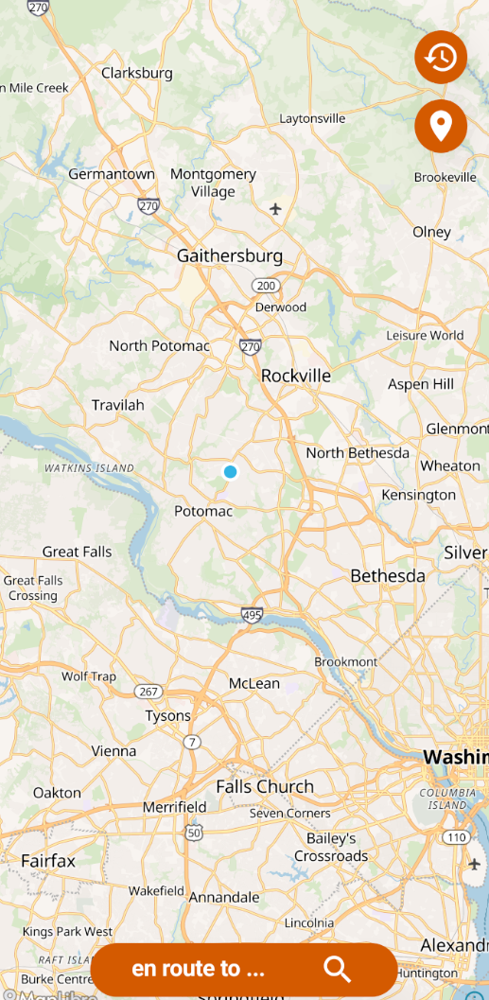
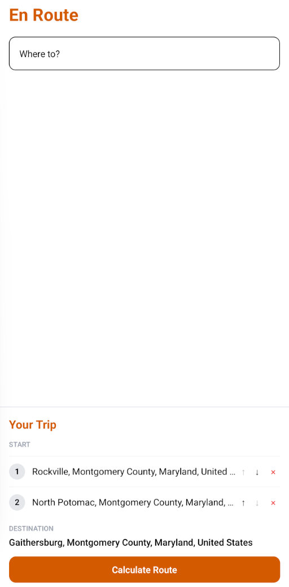
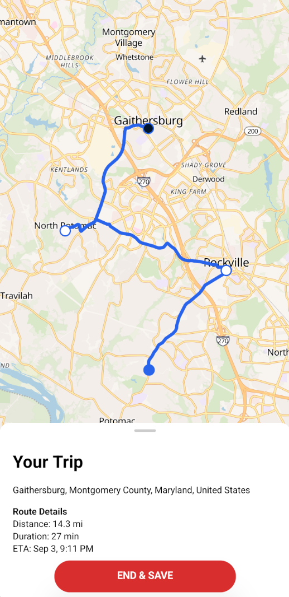

  

  Full-stack navigation and trip optimization application.

# En Route

En Route is a full-stack navigation application built with React Native and FastAPI that focuses on intelligent trip planning rather than simple point-to-point navigation. The application calculates optimized routes, supports multi-stop trips, provides real-time route calculation.

Unlike traditional navigation applications that primarily calculate the fastest route between two locations, En Route is built around trip optimization. The application allows users to efficiently organize multiple destinations while maintaining a clean and responsive mobile navigation experience.

  
  
  

## Architecture

En Route follows a client-server architecture.

The React Native application is responsible for user interaction, map rendering, and presenting navigation information.

The FastAPI backend performs all routing, optimization, and navigation calculations.

Valhalla serves as the routing engine while Nominatim provides address and location search through OpenStreetMap data.

SQLite is used during the MVP to persist local application data including trip history.

## Technology Stack

Mobile
React Native
Expo
Expo Router
TypeScript
NativeWind (Tailwind CSS)
MapLibre
OpenStreetMap
Backend
Python
FastAPI
Pydantic
Uvicorn
Routing & Mapping
Valhalla
Nominatim Geocoder
OpenStreetMap
Local Storage
SQLite
Development
Docker
Git
GitHub

## Project Structure

The project separates the mobile application, backend services, and infrastructure.

The frontend handles the user interface and mobile application logic.

The backend handles API requests and coordinates search, routing, and optimization.

Docker contains the infrastructure required to run the backend services.

## Root Directory Breakdown

src/ contains the frontend application.

backend/ contains the FastAPI server and backend logic.

docker/ contains infrastructure configuration used to run the routing services.

map-data/ contains the local OpenStreetMap PBF used to build the routing and search data.

docker-compose.yml connects the backend services and exposes their required ports.

.env contains local network, port, and service configuration.

## Docker

The backend services can be run with Docker.

Build the project with:

docker compose build

Start the services with:

docker compose up

## OpenStreetMap Map Data

En Route uses OpenStreetMap data for geocoding and routing.

The .osm.pbf map file is intentionally not included in the repository.

Each user should obtain the appropriate OpenStreetMap .osm.pbf extract for the geographic area they want to use.

Place the downloaded file in:

map-data/

The Docker configuration mounts this directory into the routing services.

Valhalla requires its own tile data to be generated from the .osm.pbf file before it can provide routing.

For instructions on building Valhalla tiles, follow the official Valhalla documentation:

https://valhalla.github.io/valhalla/

The exact tile-building process depends on the map extract and Valhalla configuration being used.

Nominatim also requires the appropriate OpenStreetMap data to initialize its search database.

## Purpose

The objective of En Route is to create a modern navigation platform that combines intelligent trip optimization with a clean mobile experience.

Rather than simply providing directions, En Route focuses on helping users plan more efficient journeys through optimized routing, checkpoint management, and vehicle-aware navigation while maintaining a scalable full-stack architecture capable of supporting future cloud-based features.

# License

See LICENSE.md for the project license.